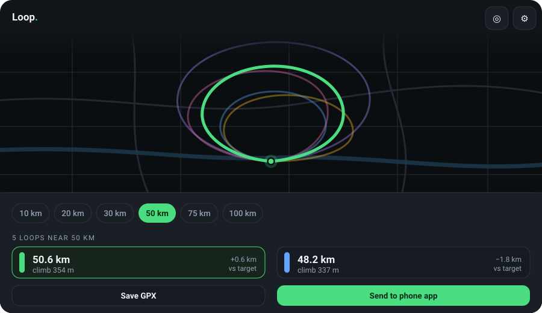

# Loop

Generate cycling round trips of a chosen distance that start and end at your door.

Pick a distance, tap once, get five loops to choose from — then send the GPX
straight to your navigation app. Works in any browser; installs to an Android
or iOS home screen as a standalone app.

**Live:** https://rajathpi.github.io/bikeloop

Interface illustration, not a screenshot — the loops drawn here are decorative.
Open the live app to see real routes on real roads.

## Why

Google Maps can route between points you place yourself, but it has no way to say
"give me a 50 km loop from here". This does exactly that.

## Using it

1. Open the app and paste an [openrouteservice API key](https://openrouteservice.org/dev/#/signup)
   (free, no card). It is stored in your browser's localStorage on that device only —
   it never touches this repo.
2. Tap ◎ to set your start point from GPS, or tap the map to place it anywhere.
3. Choose a distance and hit **Find loops**.
4. Tap a card to preview that loop, then **Send to phone app** (Android share sheet →
   OsmAnd, Komoot, Ride with GPS) or **Save GPX**.

Your start point and last distance are remembered.

## How it works

Each search fires six requests to the openrouteservice Directions API using
`options.round_trip`, varying both `seed` and `points` so the loops differ in
direction *and* shape. Round trips are approximate by design, so results are sorted
by how close they landed to the target and the five best are kept.

Notes and limits:

- openrouteservice caps round trips at **100 km**.
- Returned distance can miss the target by a few km — that is why you get several
  to choose from rather than one.
- GPX output is thinned to 2000 points, which keeps files small enough for apps and
  bike computers that choke on dense tracks.

## Replacing the illustration with a real demo

The illustration above is a placeholder. To swap in a recording of the app actually
working, drop the file at `assets/demo.gif` and change the image line near the top of
this README to point at it.

On Android: swipe down twice for Quick Settings, tap **Screen record**, open Loop, run
one search, tap through a couple of loops, stop the recording. Convert the resulting
MP4 with any of these:

    ffmpeg -i demo.mp4 -vf "fps=12,scale=420:-1:flags=lanczos" -loop 0 assets/demo.gif

Keep it under ~10 MB so GitHub renders it inline, and trim to the interesting 8–12
seconds — the search, the results appearing, and one route being selected.

## Stack

Single HTML file, no build step. Leaflet + OpenStreetMap tiles, openrouteservice for
routing, a small service worker for the app shell so it opens instantly and survives
a flaky signal. Route generation and map tiles always need the network.

## Running locally

Any static server works; a secure context is required for geolocation, the share
sheet and home-screen install, so `localhost` or https only:

    python -m http.server 5183

Then open http://localhost:5183
